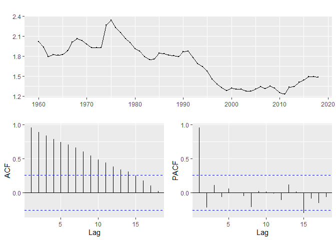

Idősor: ADF-teszt, kointegráció
================
Granát Marcell
2020-06-01

``` r
library(tidyverse)
library(ggplot2)
library(forecast)
library(urca)
```

Urca ha nincs betöltve, akkor nem lehet lekérni a summary-t a modellből

``` r
load("C:/Users/user/Desktop/OkoR/econometrics/ADF-test&coint_dataset.RData")
```

``` r
x <- LiveBirthAndFertility$TotalFertility %>% ts(start = 1960)
x %>% forecast::ggtsdisplay()
```

<!-- -->

# ADF-tesztek

``` r
x %>% tseries::adf.test(k = 1)
```

``` 

    Augmented Dickey-Fuller Test

data:  .
Dickey-Fuller = -2.5145, Lag order = 1, p-value = 0.3669
alternative hypothesis: stationary
```

Gretl 1-et javasol, nincs nagy eltérés.

``` r
x %>%
  ur.df(type = "drift", selectlags = "AIC") %>%
  summary()
```

``` 

############################################### 
# Augmented Dickey-Fuller Test Unit Root Test # 
############################################### 

Test regression drift 


Call:
lm(formula = z.diff ~ z.lag.1 + 1 + z.diff.lag)

Residuals:
     Min       1Q   Median       3Q      Max 
-0.11180 -0.03912 -0.00698  0.01822  0.35599 

Coefficients:
            Estimate Std. Error t value Pr(>|t|)   
(Intercept)  0.06482    0.05222   1.241  0.21989   
z.lag.1     -0.04103    0.03041  -1.349  0.18286   
z.diff.lag   0.38248    0.12378   3.090  0.00316 **
---
Signif. codes:  0 '***' 0.001 '**' 0.01 '*' 0.05 '.' 0.1 ' ' 1

Residual standard error: 0.06983 on 54 degrees of freedom
Multiple R-squared:  0.165, Adjusted R-squared:  0.134 
F-statistic: 5.334 on 2 and 54 DF,  p-value: 0.007694


Value of test-statistic is: -1.3493 1.0278 

Critical values for test statistics: 
      1pct  5pct 10pct
tau2 -3.51 -2.89 -2.58
phi1  6.70  4.71  3.86
```

Teljesen más a t-statisztika, mint a greltben, pedig a regresszió
eredmenyéi megegyeznek.

``` r
x %>%
  ur.df(type = "none", selectlags = "AIC") %>%
  summary()
```

``` 

############################################### 
# Augmented Dickey-Fuller Test Unit Root Test # 
############################################### 

Test regression none 


Call:
lm(formula = z.diff ~ z.lag.1 - 1 + z.diff.lag)

Residuals:
     Min       1Q   Median       3Q      Max 
-0.13272 -0.03431 -0.00830  0.02336  0.34929 

Coefficients:
            Estimate Std. Error t value Pr(>|t|)   
z.lag.1    -0.003895   0.005454  -0.714  0.47818   
z.diff.lag  0.364642   0.123545   2.952  0.00464 **
---
Signif. codes:  0 '***' 0.001 '**' 0.01 '*' 0.05 '.' 0.1 ' ' 1

Residual standard error: 0.07017 on 55 degrees of freedom
Multiple R-squared:  0.1507,    Adjusted R-squared:  0.1198 
F-statistic:  4.88 on 2 and 55 DF,  p-value: 0.01119


Value of test-statistic is: -0.7141 

Critical values for test statistics: 
     1pct  5pct 10pct
tau1 -2.6 -1.95 -1.61
```

``` r
x %>% aTSA::stationary.test()
```

    Augmented Dickey-Fuller Test 
    alternative: stationary 
     
    Type 1: no drift no trend 
         lag    ADF p.value
    [1,]   0 -1.125   0.273
    [2,]   1 -0.714   0.420
    [3,]   2 -0.572   0.471
    [4,]   3 -0.736   0.413
    Type 2: with drift no trend 
         lag   ADF p.value
    [1,]   0 -1.12   0.651
    [2,]   1 -1.35   0.571
    [3,]   2 -1.01   0.691
    [4,]   3 -1.07   0.670
    Type 3: with drift and trend 
         lag   ADF p.value
    [1,]   0 -1.42   0.807
    [2,]   1 -2.51   0.361
    [3,]   2 -2.54   0.349
    [4,]   3 -2.31   0.440
    ---- 
    Note: in fact, p.value = 0.01 means p.value <= 0.01 

**Ez a befutó\!\!\! Gretllel megegyező megoldás, nincs szükség
aktiválásra.**

``` r
x %>% aTSA::stationary.test(nlag = 10)
```

    Augmented Dickey-Fuller Test 
    alternative: stationary 
     
    Type 1: no drift no trend 
          lag    ADF p.value
     [1,]   0 -1.125   0.273
     [2,]   1 -0.714   0.420
     [3,]   2 -0.572   0.471
     [4,]   3 -0.736   0.413
     [5,]   4 -0.702   0.425
     [6,]   5 -0.800   0.390
     [7,]   6 -0.847   0.373
     [8,]   7 -0.965   0.331
     [9,]   8 -1.124   0.274
    [10,]   9 -1.065   0.295
    Type 2: with drift no trend 
          lag    ADF p.value
     [1,]   0 -1.122   0.651
     [2,]   1 -1.349   0.571
     [3,]   2 -1.008   0.691
     [4,]   3 -1.066   0.670
     [5,]   4 -0.932   0.717
     [6,]   5 -0.815   0.759
     [7,]   6 -0.950   0.711
     [8,]   7 -1.214   0.618
     [9,]   8 -1.124   0.650
    [10,]   9 -1.047   0.677
    Type 3: with drift and trend 
          lag   ADF p.value
     [1,]   0 -1.42   0.807
     [2,]   1 -2.51   0.361
     [3,]   2 -2.54   0.349
     [4,]   3 -2.31   0.440
     [5,]   4 -2.39   0.410
     [6,]   5 -2.24   0.471
     [7,]   6 -2.23   0.472
     [8,]   7 -2.07   0.539
     [9,]   8 -1.77   0.663
    [10,]   9 -1.85   0.630
    ---- 
    Note: in fact, p.value = 0.01 means p.value <= 0.01 

``` r
x %>%
  diff() %>%
  aTSA::stationary.test()
```

    Augmented Dickey-Fuller Test 
    alternative: stationary 
     
    Type 1: no drift no trend 
         lag   ADF p.value
    [1,]   0 -5.12    0.01
    [2,]   1 -5.10    0.01
    [3,]   2 -4.09    0.01
    [4,]   3 -3.79    0.01
    Type 2: with drift no trend 
         lag   ADF p.value
    [1,]   0 -5.10    0.01
    [2,]   1 -5.07    0.01
    [3,]   2 -4.10    0.01
    [4,]   3 -3.80    0.01
    Type 3: with drift and trend 
         lag   ADF p.value
    [1,]   0 -5.05  0.0100
    [2,]   1 -5.01  0.0100
    [3,]   2 -4.06  0.0134
    [4,]   3 -3.76  0.0272
    ---- 
    Note: in fact, p.value = 0.01 means p.value <= 0.01 

``` r
x %>%
  log() %>%
  aTSA::stationary.test()
```

    Augmented Dickey-Fuller Test 
    alternative: stationary 
     
    Type 1: no drift no trend 
         lag    ADF p.value
    [1,]   0 -1.295   0.213
    [2,]   1 -0.925   0.345
    [3,]   2 -0.715   0.420
    [4,]   3 -0.888   0.358
    Type 2: with drift no trend 
         lag    ADF p.value
    [1,]   0 -1.065   0.671
    [2,]   1 -1.252   0.605
    [3,]   2 -0.995   0.695
    [4,]   3 -1.059   0.673
    Type 3: with drift and trend 
         lag   ADF p.value
    [1,]   0 -1.21   0.893
    [2,]   1 -2.23   0.473
    [3,]   2 -2.43   0.395
    [4,]   3 -2.18   0.491
    ---- 
    Note: in fact, p.value = 0.01 means p.value <= 0.01 

``` r
x %>%
  log() %>%
  diff() %>%
  aTSA::stationary.test()
```

    Augmented Dickey-Fuller Test 
    alternative: stationary 
     
    Type 1: no drift no trend 
         lag   ADF p.value
    [1,]   0 -5.10    0.01
    [2,]   1 -4.76    0.01
    [3,]   2 -3.89    0.01
    [4,]   3 -3.47    0.01
    Type 2: with drift no trend 
         lag   ADF p.value
    [1,]   0 -5.10  0.0100
    [2,]   1 -4.73  0.0100
    [3,]   2 -3.91  0.0100
    [4,]   3 -3.49  0.0139
    Type 3: with drift and trend 
         lag   ADF p.value
    [1,]   0 -5.05  0.0100
    [2,]   1 -4.66  0.0100
    [3,]   2 -3.87  0.0216
    [4,]   3 -3.45  0.0568
    ---- 
    Note: in fact, p.value = 0.01 means p.value <= 0.01 

# Deviza file

``` r
deviza %>% head()
```

    # A tibble: 6 x 3
      obs          ATS   DEM
      <date>     <dbl> <dbl>
    1 1990-01-01  5.24  36.9
    2 1990-01-02  5.24  36.9
    3 1990-01-03  5.26  37.0
    4 1990-01-04  5.21  36.7
    5 1990-01-05  5.18  36.5
    6 1990-01-06  5.25  37.0

``` r
ATS <- deviza$ATS %>% ts(start = 1990, frequency = 365)
DEM <- deviza$DEM %>% ts(start = 1990, frequency = 365)
```

``` r
ATS %>% autoplot()
```

<!-- -->

``` r
DEM %>% autoplot()
```

<!-- -->

``` r
benchmark %>%
  select(-obs) %>%
  ca.jo(type = "eigen", K = 5, ecdet = "none", spec = "longrun") %>%
  summary()
```

``` 

###################### 
# Johansen-Procedure # 
###################### 

Test type: maximal eigenvalue statistic (lambda max) , with linear trend 

Eigenvalues (lambda):
[1] 7.970048e-02 2.313582e-02 1.967072e-02 1.542561e-02 9.374255e-03
[6] 2.673934e-03 8.041348e-05

Values of teststatistic and critical values of test:

           test 10pct  5pct  1pct
r <= 6 |   0.30  6.50  8.18 11.65
r <= 5 |   9.94 12.91 14.90 19.19
r <= 4 |  34.95 18.90 21.07 25.75
r <= 3 |  57.69 24.78 27.14 32.14
r <= 2 |  73.73 30.84 33.32 38.78
r <= 1 |  86.87 36.25 39.43 44.59
r = 0  | 308.22 42.06 44.91 51.30

Eigenvectors, normalised to first column:
(These are the cointegration relations)

              Yield_M3.l5 Yield_M6.l5 Yield_M12.l5 Yield_Y3.l5 Yield_Y5.l5
Yield_M3.l5   1.000000000     1.00000    1.0000000   1.0000000    1.000000
Yield_M6.l5  -1.566960037    18.29838    0.2252463  -0.4853584   -5.096400
Yield_M12.l5  0.601041962    49.49576   -1.6145653  -1.1421179   -3.508575
Yield_Y3.l5  -0.003997315  -252.05022    0.4914036   1.1452516   -4.737842
Yield_Y5.l5  -0.057629951   254.12049   -0.4211775   0.6816699   28.047665
Yield_Y10.l5  0.053940482  -123.25986    1.3175525  -4.4163138   -8.138896
Yield_Y15.l5 -0.029443317    60.70257   -0.9924826   3.2355555   -9.885246
             Yield_Y10.l5 Yield_Y15.l5
Yield_M3.l5     1.0000000    1.0000000
Yield_M6.l5    -0.1169406    0.8937286
Yield_M12.l5    0.8031482   -0.9343697
Yield_Y3.l5     0.1737350   -0.2133291
Yield_Y5.l5     1.8245136    0.1310024
Yield_Y10.l5    0.8621442   -1.1183839
Yield_Y15.l5   -7.7437137    1.8367370

Weights W:
(This is the loading matrix)

              Yield_M3.l5   Yield_M6.l5  Yield_M12.l5   Yield_Y3.l5
Yield_M3.d  -7.219036e-02 -9.274848e-05 -0.0172908078 -0.0013715155
Yield_M6.d   8.826289e-02 -7.015517e-05 -0.0062039121  0.0020296884
Yield_M12.d -5.680512e-02 -8.093946e-05  0.0135518463  0.0061800702
Yield_Y3.d  -1.409472e-02  7.606913e-05  0.0004860121  0.0015261905
Yield_Y5.d   2.327434e-05 -6.464098e-05 -0.0003338055  0.0029473776
Yield_Y10.d -1.304986e-02  1.990963e-05 -0.0069656048  0.0073427858
Yield_Y15.d -9.116990e-03  4.658573e-06  0.0002619235  0.0001085377
              Yield_Y5.l5  Yield_Y10.l5  Yield_Y15.l5
Yield_M3.d   5.992739e-04 -1.420512e-04 -0.0002056705
Yield_M6.d   7.222126e-04 -1.206627e-04 -0.0002208701
Yield_M12.d  6.269831e-04 -4.684039e-05 -0.0002365469
Yield_Y3.d  -1.803340e-04  4.091184e-04 -0.0003116609
Yield_Y5.d  -4.367146e-04  6.598361e-04 -0.0002701596
Yield_Y10.d -8.046874e-05  8.393043e-04 -0.0001998917
Yield_Y15.d  9.473069e-05  8.429627e-04 -0.0001736484
```

Gretl Lmax tesztjével ekvivalens. K adja meg a lag ordert, de nem tudni
miként kell választani (Gretl-ben is manuálisan kell megadni, alapból 5)

``` r
deviza %>%
  select(-obs) %>%
  tsDyn::VECM(lag = 5) %>%
  summary()
```

``` 
#############
###Model VECM 
#############
Full sample size: 2992  End sample size: 2986
Number of variables: 2  Number of estimated slope parameters 24
AIC -36363.89   BIC -36213.84   SSR 346.7103
Cointegrating vector (estimated by 2OLS):
   ATS        DEM
r1   1 -0.1421364

             ECT                Intercept         ATS -1             
Equation ATS -0.4545(0.2107)*   0.0048(0.0009)*** -0.4523(0.2118)*   
Equation DEM 0.0081(1.4770)     0.0335(0.0063)*** -0.9912(1.4847)    
             DEM -1             ATS -2              DEM -2            
Equation ATS 0.0576(0.0302).    -0.3069(0.2019)     0.0399(0.0288)    
Equation DEM 0.0990(0.2117)     -0.7478(1.4155)     0.0803(0.2017)    
             ATS -3              DEM -3             ATS -4             
Equation ATS -0.2822(0.1853)     0.0414(0.0264)     -0.1544(0.1655)    
Equation DEM -0.6863(1.2991)     0.1084(0.1853)     -0.2454(1.1604)    
             DEM -4             ATS -5              DEM -5            
Equation ATS 0.0201(0.0236)     -0.1406(0.1319)     0.0280(0.0189)    
Equation DEM 0.0236(0.1657)     -0.5673(0.9245)     0.1332(0.1326)    
```
