Econometrics II
================
Granát Marcell
2020-06-01

## Setup

``` r
library(tidyverse)
```

## Session 1

``` r
utas <- readr::read_csv("Utas95_teljes.csv")
```

### Polinominal trend

``` r
library(forecast) # autoplot to ts object

utas %>%
  .$buszMfo %>%
  ts(start = 1995, frequency = 4) %>%
  autoplot(size = 1)
```

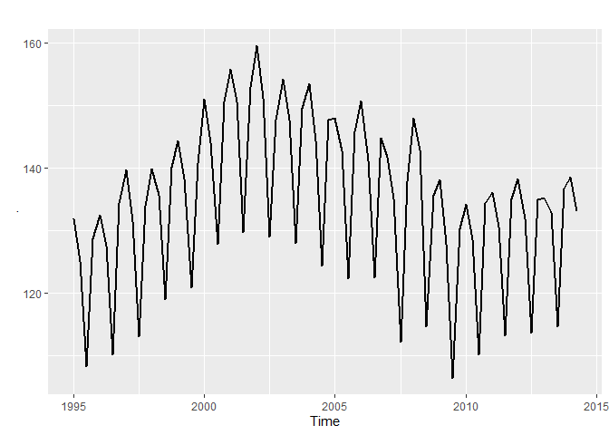<!-- -->

``` r
utas %>% head()
```

    # A tibble: 6 x 2
      obs    buszMfo
      <chr>    <dbl>
    1 1995Q1    132.
    2 1995Q2    125 
    3 1995Q3    108.
    4 1995Q4    129.
    5 1996Q1    132.
    6 1996Q2    128.

#### Dummies

``` r
periodic_dummies <- str_remove(utas$obs, ".*Q") %>%
  mlr::createDummyFeatures() %>%
  setNames(str_c("Q", names(.)))

periodic_dummies %>% head()
```

``` 
  Q1 Q2 Q3 Q4
1  1  0  0  0
2  0  1  0  0
3  0  0  1  0
4  0  0  0  1
5  1  0  0  0
6  0  1  0  0
```

``` r
effect_dummies <- periodic_dummies %>%
  mutate_all(
    function(x) (x - .$Q4)
  ) %>%
  select(-Q4) %>%
  set_names(str_c("K", 1:3))

effect_dummies %>% head()
```

``` 
  K1 K2 K3
1  1  0  0
2  0  1  0
3  0  0  1
4 -1 -1 -1
5  1  0  0
6  0  1  0
```

``` r
design_matrix <- utas %>%
  select(buszMfo) %>%
  mutate(
    time = seq_along(buszMfo),
    time2 = time^2,
    time3 = time^3
  ) %>%
  cbind(effect_dummies)

design_matrix %>% head()
```

``` 
  buszMfo time time2 time3 K1 K2 K3
1   131.8    1     1     1  1  0  0
2   125.0    2     4     8  0  1  0
3   108.3    3     9    27  0  0  1
4   128.7    4    16    64 -1 -1 -1
5   132.5    5    25   125  1  0  0
6   127.5    6    36   216  0  1  0
```

``` r
model1 <- design_matrix %>% lm(formula = buszMfo ~ .)
```

``` r
model1 %>%
  broom::tidy() %>%
  knitr::kable(caption = "OLS paraméterei")
```

| term        |     estimate | std.error |   statistic |   p.value |
| :---------- | -----------: | --------: | ----------: | --------: |
| (Intercept) |  112.8839729 | 1.6690625 |   67.633163 | 0.0000000 |
| time        |    2.5332562 | 0.1817257 |   13.940000 | 0.0000000 |
| time2       |  \-0.0632377 | 0.0053259 | \-11.873694 | 0.0000000 |
| time3       |    0.0004306 | 0.0000443 |    9.713832 | 0.0000000 |
| K1          |    9.3437320 | 0.6823372 |   13.693717 | 0.0000000 |
| K2          |    2.6532596 | 0.6823372 |    3.888488 | 0.0002246 |
| K3          | \-17.0276374 | 0.6940148 | \-24.534979 | 0.0000000 |

OLS paraméterei

``` r
model1 %>%
  broom::augment() %>%
  select(buszMfo, .fitted) %>%
  setNames(c("actual", "fitted")) %>%
  ts(start = 1995, frequency = 4) %>%
  autoplot(size = 1) + ggtitle("Model1")
```

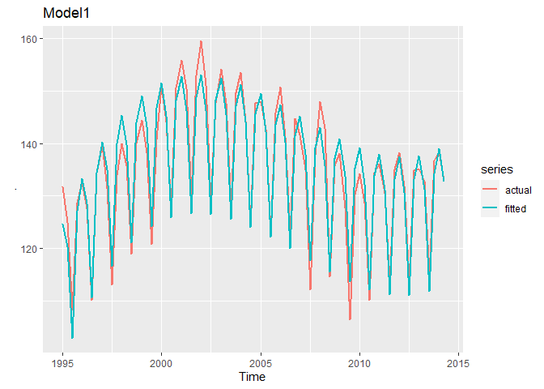<!-- -->

### Structural break

``` r
design_matrix <- utas %>%
  mutate(
    year = as.numeric(str_remove(obs, "Q.*")),
    const2 = ifelse(year >= 2002 & year < 2010, 1, 0),
    const3 = ifelse(year >= 2010, 1, 0),
    time = seq(nrow(utas)),
    time2 = time * const2,
    time3 = time * const3
  ) %>%
  select(-obs, -year)
```

``` r
model2 <- design_matrix %>% lm(formula = buszMfo ~ .)

model2 %>%
  broom::tidy() %>%
  knitr::kable(caption = "model2 paraméterei")
```

| term        |     estimate |  std.error |   statistic |   p.value |
| :---------- | -----------: | ---------: | ----------: | --------: |
| (Intercept) |  120.5817460 |  4.1315707 |  29.1854490 | 0.0000000 |
| const2      |   50.1791044 | 10.1380086 |   4.9496017 | 0.0000047 |
| const3      | \-12.6642366 | 33.9398714 | \-0.3731374 | 0.7101425 |
| time        |    0.9386973 |  0.2489169 |   3.7711273 | 0.0003304 |
| time2       |  \-1.6690676 |  0.3216447 | \-5.1891655 | 0.0000019 |
| time3       |  \-0.6277582 |  0.5436939 | \-1.1546170 | 0.2520651 |

model2 paraméterei

``` r
model2 %>%
  broom::augment() %>%
  select(buszMfo, .fitted) %>%
  setNames(c("actual", "fitted")) %>%
  ts(start = 1995, frequency = 4) %>%
  autoplot(size = 1) + ggtitle("Model2")
```

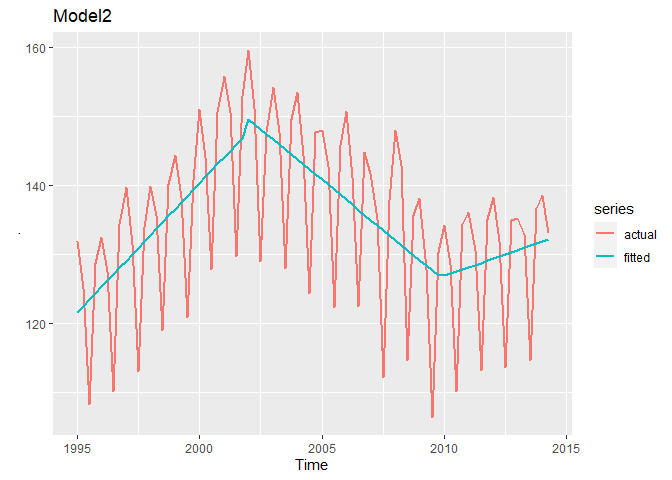<!-- -->

``` r
design_matrix <- design_matrix %>% cbind(effect_dummies)

model3 <- design_matrix %>% lm(formula = buszMfo ~ .)

model3 %>%
  broom::tidy() %>%
  knitr::kable(caption = "model3 paraméterei")
```

| term        |     estimate | std.error |   statistic |   p.value |
| :---------- | -----------: | --------: | ----------: | --------: |
| (Intercept) |  119.6998157 | 0.9105685 |  131.456139 | 0.0000000 |
| const2      |   48.9894037 | 2.2302059 |   21.966314 | 0.0000000 |
| const3      |  \-8.4621222 | 7.4669245 |  \-1.133281 | 0.2610188 |
| time        |    0.9995201 | 0.0549046 |   18.204661 | 0.0000000 |
| time2       |  \-1.6833368 | 0.0707081 | \-23.806852 | 0.0000000 |
| time3       |  \-0.7457974 | 0.1196133 |  \-6.235068 | 0.0000000 |
| K1          |    9.2020678 | 0.4570112 |   20.135324 | 0.0000000 |
| K2          |    2.6123318 | 0.4554371 |    5.735878 | 0.0000002 |
| K3          | \-16.9561209 | 0.4631947 | \-36.606899 | 0.0000000 |

model3 paraméterei

``` r
model3 %>%
  broom::augment() %>%
  select(buszMfo, .fitted) %>%
  setNames(c("actual", "fitted")) %>%
  ts(start = 1995, frequency = 4) %>%
  autoplot(size = 1) + ggtitle("Model3")
```

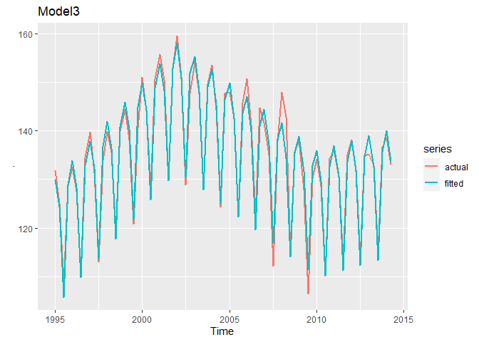<!-- -->

## BJ6

``` r
BJ_6 <- readr::read_csv("BJ_6.csv")
```

``` r
y <- BJ_6$Y %>% ts(start = 1900, frequency = 4)

y %>% autoplot(size = 1)
```

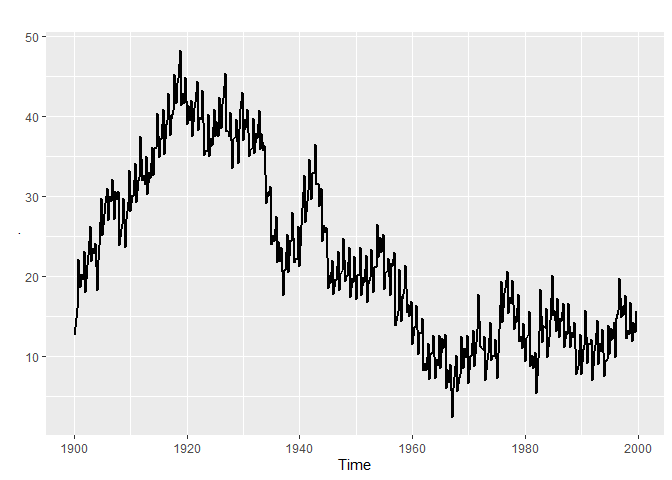<!-- -->

``` r
y %>% aTSA::stationary.test(nlag = 20)
```

    Augmented Dickey-Fuller Test 
    alternative: stationary 
     
    Type 1: no drift no trend 
          lag    ADF p.value
     [1,]   0 -1.407   0.176
     [2,]   1 -0.741   0.414
     [3,]   2 -0.763   0.406
     [4,]   3 -0.468   0.509
     [5,]   4 -1.069   0.297
     [6,]   5 -0.658   0.444
     [7,]   6 -0.660   0.443
     [8,]   7 -0.671   0.439
     [9,]   8 -0.855   0.373
    [10,]   9 -0.778   0.401
    [11,]  10 -0.873   0.367
    [12,]  11 -0.815   0.387
    [13,]  12 -0.913   0.353
    [14,]  13 -0.699   0.429
    [15,]  14 -0.701   0.428
    [16,]  15 -0.695   0.430
    [17,]  16 -0.768   0.404
    [18,]  17 -0.755   0.409
    [19,]  18 -0.795   0.395
    [20,]  19 -0.882   0.364
    Type 2: with drift no trend 
          lag    ADF p.value
     [1,]   0 -3.339  0.0151
     [2,]   1 -1.757  0.4244
     [3,]   2 -1.724  0.4373
     [4,]   3 -0.674  0.8147
     [5,]   4 -1.946  0.3493
     [6,]   5 -0.939  0.7211
     [7,]   6 -0.947  0.7182
     [8,]   7 -1.011  0.6958
     [9,]   8 -1.443  0.5435
    [10,]   9 -1.082  0.6706
    [11,]  10 -1.214  0.6240
    [12,]  11 -1.150  0.6466
    [13,]  12 -1.288  0.5981
    [14,]  13 -0.865  0.7474
    [15,]  14 -0.884  0.7407
    [16,]  15 -1.075  0.6730
    [17,]  16 -1.253  0.6103
    [18,]  17 -0.962  0.7129
    [19,]  18 -0.980  0.7068
    [20,]  19 -0.978  0.7074
    Type 3: with drift and trend 
          lag   ADF p.value
     [1,]   0 -5.72  0.0100
     [2,]   1 -3.71  0.0233
     [3,]   2 -3.63  0.0300
     [4,]   3 -2.84  0.2205
     [5,]   4 -3.62  0.0306
     [6,]   5 -2.75  0.2582
     [7,]   6 -2.79  0.2445
     [8,]   7 -2.89  0.2004
     [9,]   8 -3.29  0.0732
    [10,]   9 -2.74  0.2624
    [11,]  10 -2.79  0.2424
    [12,]  11 -2.83  0.2261
    [13,]  12 -2.91  0.1931
    [14,]  13 -2.67  0.2921
    [15,]  14 -2.72  0.2707
    [16,]  15 -3.06  0.1308
    [17,]  16 -3.18  0.0917
    [18,]  17 -2.74  0.2652
    [19,]  18 -2.67  0.2933
    [20,]  19 -2.45  0.3877
    ---- 
    Note: in fact, p.value = 0.01 means p.value <= 0.01 

``` r
d_y <- diff(y)

d_y %>% autoplot(size = 0.6)
```

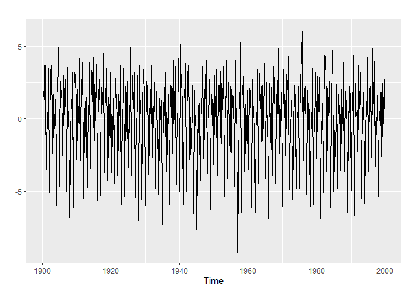<!-- -->

``` r
model4 <- BJ_6$obs %>%
  str_remove(".*Q") %>%
  mlr::createDummyFeatures() %>%
  setNames(str_c("Q", names(.))) %>%
  select(-Q4) %>%
  tail(-1) %>%
  mutate(
    d_y = d_y
  ) %>%
  lm(formula = d_y ~ .)

model4 %>%
  broom::tidy() %>%
  knitr::kable(caption = "szezonalitás hatások")
```

| term        |    estimate | std.error |   statistic | p.value |
| :---------- | ----------: | --------: | ----------: | ------: |
| (Intercept) |   3.2305576 | 0.1122322 |   28.784584 |       0 |
| Q1          | \-8.7163723 | 0.1591206 | \-54.778394 |       0 |
| Q2          | \-0.8979273 | 0.1587203 |  \-5.657292 |       0 |
| Q3          | \-3.3319906 | 0.1587203 | \-20.992842 |       0 |

szezonalitás hatások

``` r
model4_res <- model4$residuals %>% ts(start = c(1900, 2), frequency = 4)
```

``` r
model4_res %>% autoplot(size = .6)
```

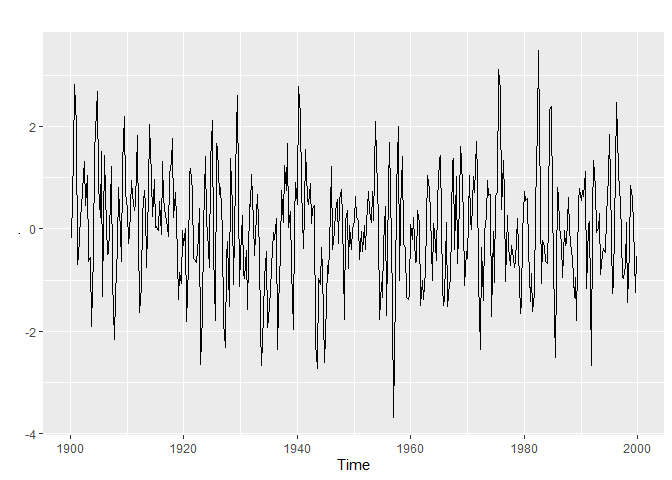<!-- -->

``` r
model4_res %>% aTSA::stationary.test(nlag = 20)
```

    Augmented Dickey-Fuller Test 
    alternative: stationary 
     
    Type 1: no drift no trend 
          lag    ADF p.value
     [1,]   0 -12.51    0.01
     [2,]   1 -13.14    0.01
     [3,]   2 -11.18    0.01
     [4,]   3  -9.92    0.01
     [5,]   4  -8.85    0.01
     [6,]   5  -8.41    0.01
     [7,]   6  -7.57    0.01
     [8,]   7  -6.82    0.01
     [9,]   8  -5.79    0.01
    [10,]   9  -5.29    0.01
    [11,]  10  -6.00    0.01
    [12,]  11  -6.16    0.01
    [13,]  12  -6.16    0.01
    [14,]  13  -5.59    0.01
    [15,]  14  -5.05    0.01
    [16,]  15  -4.99    0.01
    [17,]  16  -5.00    0.01
    [18,]  17  -4.63    0.01
    [19,]  18  -4.86    0.01
    [20,]  19  -4.84    0.01
    Type 2: with drift no trend 
          lag    ADF p.value
     [1,]   0 -12.49    0.01
     [2,]   1 -13.13    0.01
     [3,]   2 -11.16    0.01
     [4,]   3  -9.91    0.01
     [5,]   4  -8.84    0.01
     [6,]   5  -8.40    0.01
     [7,]   6  -7.57    0.01
     [8,]   7  -6.81    0.01
     [9,]   8  -5.78    0.01
    [10,]   9  -5.29    0.01
    [11,]  10  -5.99    0.01
    [12,]  11  -6.15    0.01
    [13,]  12  -6.16    0.01
    [14,]  13  -5.58    0.01
    [15,]  14  -5.05    0.01
    [16,]  15  -4.99    0.01
    [17,]  16  -5.00    0.01
    [18,]  17  -4.64    0.01
    [19,]  18  -4.86    0.01
    [20,]  19  -4.85    0.01
    Type 3: with drift and trend 
          lag    ADF p.value
     [1,]   0 -12.52    0.01
     [2,]   1 -13.15    0.01
     [3,]   2 -11.18    0.01
     [4,]   3  -9.93    0.01
     [5,]   4  -8.87    0.01
     [6,]   5  -8.44    0.01
     [7,]   6  -7.60    0.01
     [8,]   7  -6.84    0.01
     [9,]   8  -5.80    0.01
    [10,]   9  -5.30    0.01
    [11,]  10  -6.01    0.01
    [12,]  11  -6.17    0.01
    [13,]  12  -6.19    0.01
    [14,]  13  -5.62    0.01
    [15,]  14  -5.10    0.01
    [16,]  15  -5.03    0.01
    [17,]  16  -5.03    0.01
    [18,]  17  -4.65    0.01
    [19,]  18  -4.86    0.01
    [20,]  19  -4.86    0.01
    ---- 
    Note: in fact, p.value = 0.01 means p.value <= 0.01 

``` r
model4_res %>% forecast::ggtsdisplay()
```

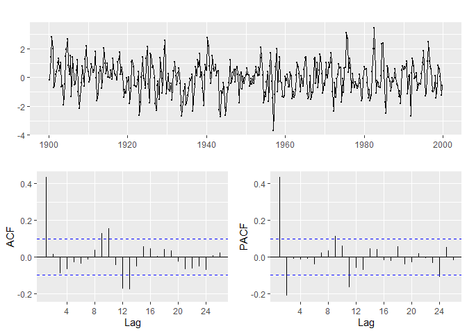<!-- -->

``` r
arma1 <- arima(model4_res, order = c(2, 0, 0), include.mean = T)
arma1
```

``` 

Call:
arima(x = model4_res, order = c(2, 0, 0), include.mean = T)

Coefficients:
         ar1      ar2  intercept
      0.5264  -0.2137    -0.0010
s.e.  0.0489   0.0490     0.0715

sigma^2 estimated as 0.9654:  log likelihood = -559.29,  aic = 1126.57
```

``` r
arma2 <- arima(model4_res, order = c(2, 0, 0), include.mean = F)
arma2
```

``` 

Call:
arima(x = model4_res, order = c(2, 0, 0), include.mean = F)

Coefficients:
         ar1      ar2
      0.5264  -0.2137
s.e.  0.0489   0.0490

sigma^2 estimated as 0.9654:  log likelihood = -559.29,  aic = 1124.57
```

``` r
arma3 <- model4_res %>% arma(order = c(2, 1), include.intercept = F)
arima(model4_res, order = c(2, 0, 1), include.mean = F)
```

``` 

Call:
arima(x = model4_res, order = c(2, 0, 1), include.mean = F)

Coefficients:
         ar1      ar2      ma1
      0.5881  -0.2405  -0.0647
s.e.  0.2464   0.1133   0.2546

sigma^2 estimated as 0.9653:  log likelihood = -559.25,  aic = 1126.51
```

``` r
arma3
```

``` 

Call:
arma(x = ., order = c(2, 1), include.intercept = F)

Coefficient(s):
    ar1      ar2      ma1  
 0.7558  -0.3054  -0.2446  
```

``` r
checkresiduals(arma2)
```

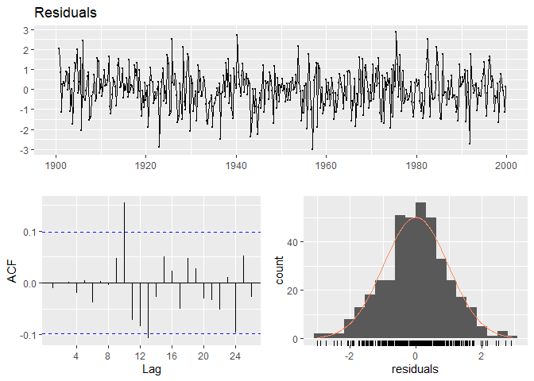<!-- -->

[](https://latex.codecogs.com/svg.latex?%5Cdpi%7B120%7D%20%7B%5Ccolor%7BOrange%7D%20%5CDelta%20y_%7Bt%7D%20%3D%203%2C23%20-%208%2C72%20d_%7B1%7D%20-%200%2C9d_%7B2%7D%20-%203%2C3%20d_%7B3%7D%20+%20v_%7Bt%7D%7D)<!-- -->

[](https://latex.codecogs.com/svg.latex?%5Cdpi%7B120%7D%20%7B%5Ccolor%7BOrange%7D%20v_%7Bt%7D%20%3D%200%2C53%20v_%7Bt-1%7D%20-%200%2C21%20v_%7Bt-2%7D%20+%20u_%7Bt%7D%7D)<!-- -->

[](https://latex.codecogs.com/svg.latex?%5Cdpi%7B120%7D%20%7B%5Ccolor%7BOrange%7D%20u_%7Bt%7D%20%3D%20white%5C%20noise%7D)<!-- -->

``` r
predict_df <- expand.grid(1900:2005, c("Q1", "Q2", "Q3", "Q4")) %>%
  setNames(c("year", "Q")) %>%
  arrange(year)

predict_df["dy_v"] <- c(
  NA, model4$fitted.values,
  predict.lm(object = model4, newdata = predict_df$Q %>% mlr::createDummyFeatures() %>% select(-Q4) %>% tail(nrow(predict_df) - nrow(BJ_6)))
)

arma2$fitted.values
```

    NULL

``` r
predict_df["v"] <- c(
  NA, fitted(arma2),
  predict(arma2, n.ahead = 24)$pred
)
```

``` r
predict_df["actual"] <- c(
  BJ_6$Y, rep(NA, 24)
)
```

``` r
predict_df <- predict_df %>% mutate(
  fitted = c(actual[1], tail(predict_df$dy_v,-1) + tail(predict_df$v,-1)),
  fitted = cumsum(fitted)
)
```

``` r
predict_df %>% select(actual, fitted, dy_v) %>% 
  mutate(
    time = str_c(predict_df$year, "Q", 1:4)
  ) %>% gather(key = "key", value = "value", -time) %>% mutate(
    t = rep(1:nrow(predict_df), 3)
  ) %>% ggplot() + geom_line(aes(x = t, y = value, color = key), size = .5)
```

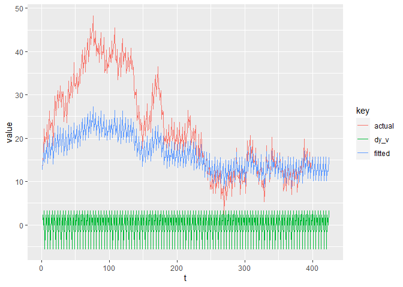<!-- -->

## BJ5 megoldás

``` r
BJ_5 <- readr::read_csv("BJ_5.csv")
```

``` r
BJ_5$Y %>% ts(start = 1900, frequency = 4) %>% autoplot()
```

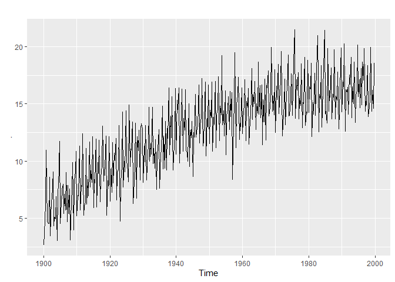<!-- -->

Nem találtam még kvadratikus regresszióval működő adftesztet. Más
tesztekhez lehet megadni

``` r
ols_model <- BJ_5 %>% select(-obs, -dq1) %>% lm(formula = Y ~ .)

ols_model %>% broom::tidy() %>% knitr::kable(caption = "OLS eredményei")
```

| term        |    estimate | std.error |  statistic | p.value |
| :---------- | ----------: | --------: | ---------: | ------: |
| (Intercept) |   2.9707798 | 0.1929017 |   15.40049 |       0 |
| t           |   0.0544518 | 0.0019299 |   28.21464 |       0 |
| dq2         |   2.4182479 | 0.1572062 |   15.38265 |       0 |
| dq3         |   2.1348211 | 0.1572084 |   13.57956 |       0 |
| dq4         |   5.3674236 | 0.1572120 |   34.14130 |       0 |
| sq\_t       | \-0.0000678 | 0.0000047 | \-14.53692 |       0 |

OLS eredményei

``` r
Y <- ols_model$residuals %>% ts(start = 1990, frequency = 4)

Y %>% forecast::ggtsdisplay()
```

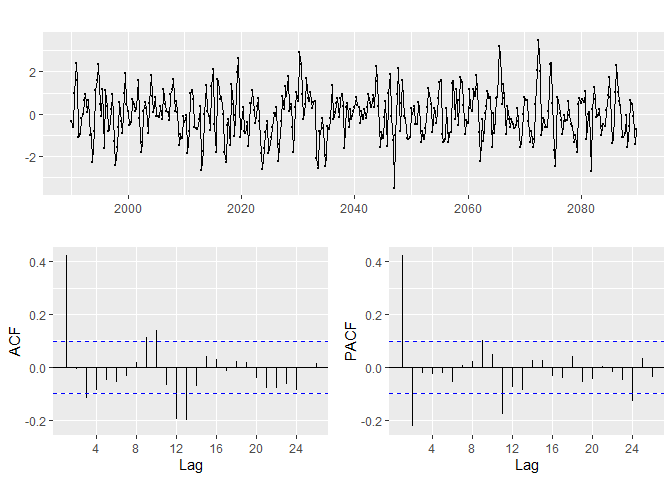<!-- -->

``` r
Y %>% Box.test(lag = 1, type = "Ljung-Box")
```

``` 

    Box-Ljung test

data:  .
X-squared = 71.56, df = 1, p-value < 2.2e-16
```

``` r
arma <- Y %>% auto.arima(seasonal = F, trace = T, approximation = F)
```

``` 

 ARIMA(2,0,2)           with non-zero mean : 1126.491
 ARIMA(0,0,0)           with non-zero mean : 1217.783
 ARIMA(1,0,0)           with non-zero mean : 1141.692
 ARIMA(0,0,1)           with non-zero mean : 1127.072
 ARIMA(0,0,0)           with zero mean     : 1215.763
 ARIMA(1,0,2)           with non-zero mean : 1128.43
 ARIMA(2,0,1)           with non-zero mean : 1125.002
 ARIMA(1,0,1)           with non-zero mean : 1127.389
 ARIMA(2,0,0)           with non-zero mean : 1123.226
 ARIMA(3,0,0)           with non-zero mean : 1125.07
 ARIMA(3,0,1)           with non-zero mean : Inf
 ARIMA(2,0,0)           with zero mean     : 1121.185
 ARIMA(1,0,0)           with zero mean     : 1139.663
 ARIMA(3,0,0)           with zero mean     : 1123.019
 ARIMA(2,0,1)           with zero mean     : 1122.952
 ARIMA(1,0,1)           with zero mean     : 1125.349
 ARIMA(3,0,1)           with zero mean     : Inf

 Best model: ARIMA(2,0,0)           with zero mean     
```

``` r
auto.arima(y = ts(BJ_5$Y), seasonal = F, trace = F, approximation = F, xreg = as.matrix(BJ_5 %>% select(-obs, -dq1, -Y)))
```

    Series: ts(BJ_5$Y) 
    Regression with ARIMA(2,0,0) errors 
    
    Coefficients:
             ar1      ar2  intercept       t     dq2     dq3     dq4    sq_t
          0.5149  -0.2236     2.9719  0.0544  2.4206  2.1368  5.3677  -1e-04
    s.e.  0.0487   0.0505     0.2213  0.0024  0.1188  0.1482  0.1190   1e-04
    
    sigma^2 estimated as 0.9699:  log likelihood=-557.56
    AIC=1133.12   AICc=1133.59   BIC=1169.05

itt még a konstans nem teljesen világos, kicsit más megoldást is ad

## BJ10 megoldása

``` r
BJ_10 <- readr::read_csv("BJ_10.csv")
```

``` r
Y <- BJ_10$Y %>% ts(start = 1900, frequency = 4)

Y %>% autoplot()
```

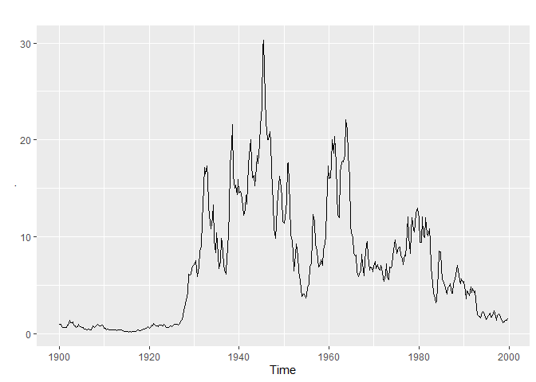<!-- -->

``` r
Y %>% aTSA::stationary.test()
```

    Augmented Dickey-Fuller Test 
    alternative: stationary 
     
    Type 1: no drift no trend 
         lag   ADF p.value
    [1,]   0 -1.45  0.1621
    [2,]   1 -1.99  0.0468
    [3,]   2 -1.69  0.0889
    [4,]   3 -1.70  0.0878
    [5,]   4 -1.44  0.1646
    [6,]   5 -1.45  0.1619
    Type 2: with drift no trend 
         lag   ADF p.value
    [1,]   0 -2.22  0.2399
    [2,]   1 -3.06  0.0318
    [3,]   2 -2.64  0.0888
    [4,]   3 -2.67  0.0835
    [5,]   4 -2.28  0.2169
    [6,]   5 -2.31  0.2064
    Type 3: with drift and trend 
         lag   ADF p.value
    [1,]   0 -2.10   0.534
    [2,]   1 -3.02   0.147
    [3,]   2 -2.56   0.342
    [4,]   3 -2.59   0.328
    [5,]   4 -2.15   0.513
    [6,]   5 -2.18   0.502
    ---- 
    Note: in fact, p.value = 0.01 means p.value <= 0.01 

``` r
ld_Y <- Y %>% log() %>% diff()
ld_Y %>% autoplot()
```

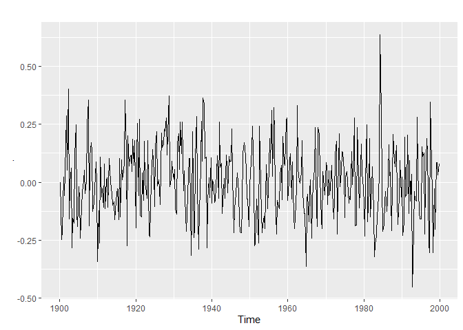<!-- -->

``` r
ld_Y %>% Box.test(lag = 1, type = "Ljung-Box")
```

``` 

    Box-Ljung test

data:  .
X-squared = 23.183, df = 1, p-value = 1.473e-06
```

``` r
ld_Y %>% forecast::ggtsdisplay()
```

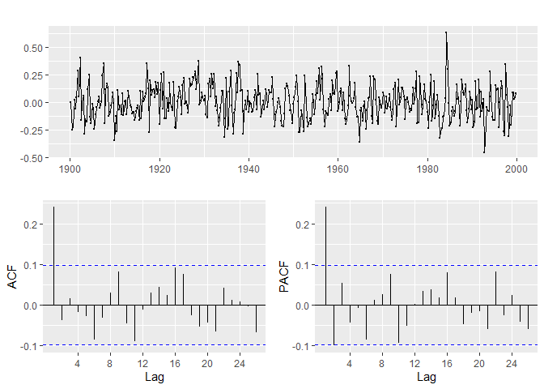<!-- -->

``` r
arima <- ld_Y %>% auto.arima(trace = T, approximation = F, seasonal = F)
```

``` 

 ARIMA(2,0,2)           with non-zero mean : -363.363
 ARIMA(0,0,0)           with non-zero mean : -340.6575
 ARIMA(1,0,0)           with non-zero mean : -362.2824
 ARIMA(0,0,1)           with non-zero mean : -366.7249
 ARIMA(0,0,0)           with zero mean     : -342.6606
 ARIMA(1,0,1)           with non-zero mean : -366.3298
 ARIMA(0,0,2)           with non-zero mean : -365.93
 ARIMA(1,0,2)           with non-zero mean : -365.4263
 ARIMA(0,0,1)           with zero mean     : -368.7422
 ARIMA(1,0,1)           with zero mean     : -368.3563
 ARIMA(0,0,2)           with zero mean     : -367.9562
 ARIMA(1,0,0)           with zero mean     : -364.3011
 ARIMA(1,0,2)           with zero mean     : -367.4643

 Best model: ARIMA(0,0,1)           with zero mean     
```

``` r
arima %>% checkresiduals()
```

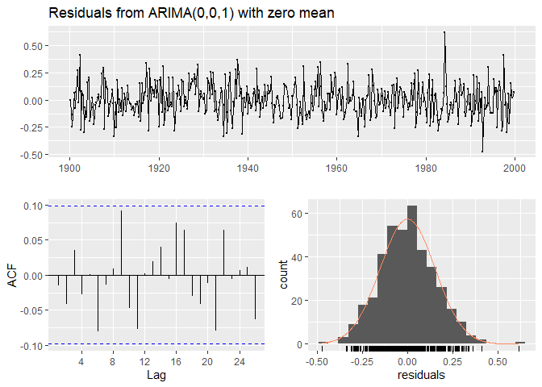<!-- -->

``` 

    Ljung-Box test

data:  Residuals from ARIMA(0,0,1) with zero mean
Q* = 4.3547, df = 7, p-value = 0.7381

Model df: 1.   Total lags used: 8
```

``` r
forecast(arima, h = 24) %>% autoplot()
```

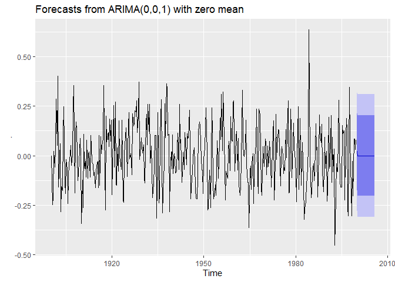<!-- -->
