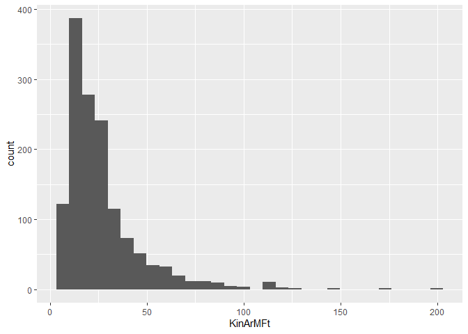
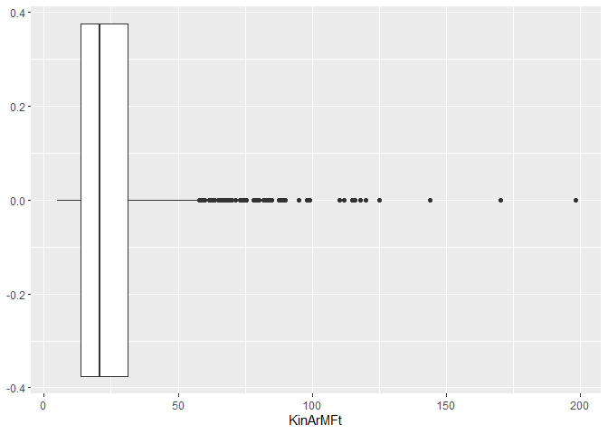
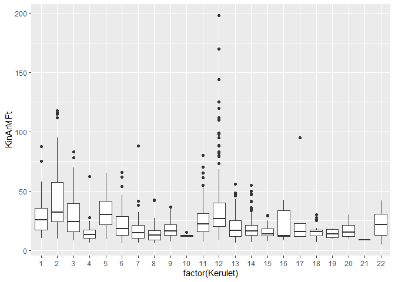
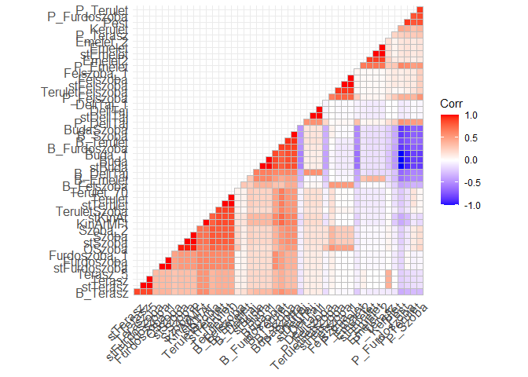

Session 1 - Histogram, Boxplot, Heatmap
================
Granát Marcell
2020-06-01

# Session 1

## Setup

``` r
library(tidyverse)
library(tidymodels)
BpHlakas <- readr::read_csv("BpHlakas.csv")
attach(BpHlakas)
```

``` r
BpHlakas %>% ggplot(aes(KinArMFt)) + geom_histogram()
```

<!-- -->

``` r
KinArMFt %>% chisq.test() # test for normality (n of bins are not equal as in GRETL)
```

``` 

    Chi-squared test for given probabilities

data:  .
X-squared = 20446, df = 1405, p-value < 2.2e-16
```

``` r
BpHlakas %>% ggplot(aes(KinArMFt)) + geom_boxplot()
```

<!-- -->

``` r
BpHlakas %>% ggplot(aes(KinArMFt, y = factor(Kerulet))) + geom_boxplot() + coord_flip()
```

<!-- -->

``` r
BpHlakas %>% cor() %>% ggcorrplot::ggcorrplot(hc.order = TRUE, type = "lower",
   lab = F) + theme(
     axis.text = element_text(size = 4)
   )
```

<!-- -->

# Session 2

``` r
BpHlakas2 <- BpHlakas %>% select(KinArMFt, Terulet, Terasz, Szoba, Felszoba, Furdoszoba, Emelet, DeliTaj, Buda)
BpHlakas2 %>% glimpse()
```

    Rows: 1,406
    Columns: 9
    $ KinArMFt   <dbl> 10.7, 10.0, 10.5, 12.0, 13.0, 13.9, 17.2, 15.9, 13.9, 18...
    $ Terulet    <dbl> 32.0, 32.0, 32.0, 34.0, 34.0, 35.0, 43.0, 44.0, 46.0, 47...
    $ Terasz     <dbl> 0, 0, 0, 0, 0, 0, 0, 3, 0, 0, 3, 0, 0, 15, 0, 0, 3, 0, 0...
    $ Szoba      <dbl> 1, 1, 1, 1, 1, 1, 2, 1, 2, 1, 1, 2, 2, 2, 3, 1, 2, 2, 2,...
    $ Felszoba   <dbl> 0, 0, 0, 0, 0, 0, 0, 0, 1, 0, 0, 0, 1, 1, 0, 0, 0, 0, 0,...
    $ Furdoszoba <dbl> 1, 1, 1, 1, 1, 1, 1, 1, 1, 1, 1, 1, 1, 1, 1, 1, 1, 1, 1,...
    $ Emelet     <dbl> 2, 2, 2, 1, 1, 0, 1, 2, 3, 2, 2, 1, 0, 1, 1, 2, 3, 0, 2,...
    $ DeliTaj    <dbl> 0, 0, 0, 1, 1, 1, 0, 0, 1, 0, 0, 0, 0, 1, 1, 1, 1, 1, 0,...
    $ Buda       <dbl> 1, 1, 1, 1, 1, 1, 1, 1, 1, 1, 1, 1, 1, 1, 1, 1, 1, 1, 1,...

``` r
simple_ols <- lm(KinArMFt ~ ., data = BpHlakas2) 
simple_ols %>% summary()
```

``` 

Call:
lm(formula = KinArMFt ~ ., data = BpHlakas2)

Residuals:
    Min      1Q  Median      3Q     Max 
-45.615  -4.204  -0.600   2.951  48.826 

Coefficients:
            Estimate Std. Error t value Pr(>|t|)    
(Intercept) -9.01894    0.77881 -11.580  < 2e-16 ***
Terulet      0.29749    0.01020  29.153  < 2e-16 ***
Terasz       0.31049    0.02067  15.022  < 2e-16 ***
Szoba        0.68981    0.34894   1.977  0.04825 *  
Felszoba    -0.38510    0.40561  -0.949  0.34257    
Furdoszoba   5.13010    0.68163   7.526 9.32e-14 ***
Emelet       0.05445    0.13217   0.412  0.68042    
DeliTaj      1.19155    0.45758   2.604  0.00931 ** 
Buda         6.21968    0.47510  13.091  < 2e-16 ***
---
Signif. codes:  0 '***' 0.001 '**' 0.01 '*' 0.05 '.' 0.1 ' ' 1

Residual standard error: 8.408 on 1397 degrees of freedom
Multiple R-squared:  0.8177,    Adjusted R-squared:  0.8167 
F-statistic: 783.3 on 8 and 1397 DF,  p-value: < 2.2e-16
```

``` r
standard_ols <- BpHlakas2 %>% mutate_all(function(x) (x - mean(x, na.rm = T)) / sd(x, T)) %>% #normalize
  lm(formula = KinArMFt ~ .)
standard_ols
```

``` 

Call:
lm(formula = KinArMFt ~ ., data = .)

Coefficients:
(Intercept)      Terulet       Terasz        Szoba     Felszoba   Furdoszoba  
 -1.107e-15    6.391e-01    1.927e-01    4.256e-02   -1.222e-02    1.099e-01  
     Emelet      DeliTaj         Buda  
  4.793e-03    3.032e-02    1.578e-01  
```

``` r
standard_betas <- standard_ols %>% tidy() %>% .[-1, 1:2]
```

``` r
recipe(KinArMFt ~ ., data = BpHlakas2) %>% 
  step_normalize(everything()) %>% 
  remove_role(KinArMFt, old_role ="predictor") %>% 
  prep() %>% juice() %>% lm()
```

``` 

Call:
lm(formula = .)

Coefficients:
(Intercept)       Terasz        Szoba     Felszoba   Furdoszoba       Emelet  
  5.801e-16   -4.463e-02    4.181e-01   -1.064e-01    4.319e-02   -3.769e-02  
    DeliTaj         Buda     KinArMFt  
  5.699e-04   -9.618e-02    5.919e-01  
```

``` r
correlations <- BpHlakas2 %>% cor() %>% .[,"KinArMFt"] %>% c() %>% .[-1]
standard_betas %>% mutate(
  cor = correlations,
  R = estimate * cor
)
```

``` 
# A tibble: 8 x 4
  term       estimate     cor         R
  <chr>         <dbl>   <dbl>     <dbl>
1 Terulet     0.639    0.860   0.549   
2 Terasz      0.193    0.548   0.106   
3 Szoba       0.0426   0.711   0.0303  
4 Felszoba   -0.0122  -0.0102  0.000125
5 Furdoszoba  0.110    0.617   0.0678  
6 Emelet      0.00479 -0.0800 -0.000383
7 DeliTaj     0.0303   0.188   0.00571 
8 Buda        0.158    0.375   0.0591  
```

``` r
sum(standard_betas$R) %>% scales::percent(accuracy = .01)
```

    [1] "0.00%"

# Session 3

### VIF

``` r
simple_ols %>% car::vif()
```

``` 
   Terulet     Terasz      Szoba   Felszoba Furdoszoba     Emelet    DeliTaj 
  3.682941   1.261302   3.552680   1.270590   1.633121   1.037153   1.038851 
      Buda 
  1.113975 
```

### Tolerance

``` r
1/(simple_ols %>% car::vif())
```

``` 
   Terulet     Terasz      Szoba   Felszoba Furdoszoba     Emelet    DeliTaj 
 0.2715222  0.7928317  0.2814777  0.7870362  0.6123244  0.9641779  0.9626016 
      Buda 
 0.8976860 
```

# Half room

``` r
simple_ols %>% car::linearHypothesis(c("Szoba = 2*Felszoba"),test="F")
```

    Linear hypothesis test
    
    Hypothesis:
    Szoba - 2 Felszoba = 0
    
    Model 1: restricted model
    Model 2: KinArMFt ~ Terulet + Terasz + Szoba + Felszoba + Furdoszoba + 
        Emelet + DeliTaj + Buda
    
      Res.Df   RSS Df Sum of Sq      F Pr(>F)
    1   1398 98897                           
    2   1397 98751  1    145.43 2.0573 0.1517

# Omit variables based on AIC

``` r
MASS::stepAIC(simple_ols, direction="backward")
```

    Start:  AIC=5996.11
    KinArMFt ~ Terulet + Terasz + Szoba + Felszoba + Furdoszoba + 
        Emelet + DeliTaj + Buda
    
                 Df Sum of Sq    RSS    AIC
    - Emelet      1        12  98763 5994.3
    - Felszoba    1        64  98815 5995.0
    <none>                     98751 5996.1
    - Szoba       1       276  99027 5998.0
    - DeliTaj     1       479  99231 6000.9
    - Furdoszoba  1      4004 102755 6050.0
    - Buda        1     12114 110866 6156.8
    - Terasz      1     15952 114703 6204.6
    - Terulet     1     60078 158829 6662.3
    
    Step:  AIC=5994.28
    KinArMFt ~ Terulet + Terasz + Szoba + Felszoba + Furdoszoba + 
        DeliTaj + Buda
    
                 Df Sum of Sq    RSS    AIC
    - Felszoba    1        65  98828 5993.2
    <none>                     98763 5994.3
    - Szoba       1       287  99050 5996.4
    - DeliTaj     1       471  99234 5999.0
    - Furdoszoba  1      4015 102778 6048.3
    - Buda        1     12215 110978 6156.2
    - Terasz      1     16042 114806 6203.9
    - Terulet     1     60575 159338 6664.8
    
    Step:  AIC=5993.2
    KinArMFt ~ Terulet + Terasz + Szoba + Furdoszoba + DeliTaj + 
        Buda
    
                 Df Sum of Sq    RSS    AIC
    <none>                     98828 5993.2
    - Szoba       1       222  99050 5994.4
    - DeliTaj     1       480  99308 5998.0
    - Furdoszoba  1      4117 102946 6048.6
    - Buda        1     12655 111484 6160.6
    - Terasz      1     15993 114822 6202.1
    - Terulet     1     68418 167247 6730.9

``` 

Call:
lm(formula = KinArMFt ~ Terulet + Terasz + Szoba + Furdoszoba + 
    DeliTaj + Buda, data = BpHlakas2)

Coefficients:
(Intercept)      Terulet       Terasz        Szoba   Furdoszoba      DeliTaj  
    -8.9788       0.3001       0.3103       0.5500       5.1858       1.1885  
       Buda  
     6.2530  
```

### Predict

``` r
predict.lm(simple_ols, newdata = apply(BpHlakas2[-1],2, median) %>% data.frame() %>% t() %>% data.frame(), level = 0.05, interval = "prediction")
```

``` 
       fit      lwr      upr
. 19.02074 18.49276 19.54872
```
