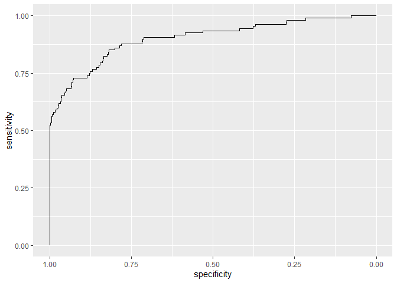

Logit
================
Granát Marcell
2020-08-12

## Setup

``` r
library(tidyverse)
load("Csod.RData")
```

## Logit model

``` r
logit_model <- csod %>% glm(formula = csod ~ eszkfseb100 + stokear100 + bonitas100 + jovedelm100 + feszkar100 + likvid100, family = "binomial")
```

``` r
logit_model %>% broom::tidy()
```

``` 
# A tibble: 7 x 5
  term        estimate std.error statistic    p.value
  <chr>          <dbl>     <dbl>     <dbl>      <dbl>
1 (Intercept) -3.14     0.897        -3.49 0.000476  
2 eszkfseb100 -0.00346  0.00125      -2.77 0.00558   
3 stokear100  -0.0463   0.0103       -4.47 0.00000780
4 bonitas100  -0.00122  0.000324     -3.78 0.000158  
5 jovedelm100 -0.0107   0.00249      -4.29 0.0000177 
6 feszkar100   0.0426   0.0107        3.99 0.0000668 
7 likvid100   -0.0214   0.0101       -2.11 0.0347    
```

``` r
logit_model %>% broom::glance()
```

    # A tibble: 1 x 7
      null.deviance df.null logLik   AIC   BIC deviance df.residual
              <dbl>   <int>  <dbl> <dbl> <dbl>    <dbl>       <int>
    1          831.    1968  -211.  435.  474.     421.        1962

``` r
logit_model %>% broom::augment()
```

    # A tibble: 1,969 x 14
        csod eszkfseb100 stokear100 bonitas100 jovedelm100 feszkar100 likvid100
       <dbl>       <dbl>      <dbl>      <dbl>       <dbl>      <dbl>     <dbl>
     1     0       29.6        99.9      0.124       15.2        9.98      9.85
     2     0      126.         98.9      1.11       -22.7      100        98.9 
     3     0      219.         99.8      0.158       32.2       88.7      88.5 
     4     0        6.09       57.9     72.7         -5.48       1.24      1.07
     5     0        4.59       16.3    512.          -2.62      92.8      92.8 
     6     0       43.6        99.6      0.368        1.59     100        99.6 
     7     0       13.7        99.7      0.261        3.62     100        99.7 
     8     0       47.4        99.9      0.121      -11.4       98.4      98.3 
     9     0       85.7        92        8.70        34.9      100        92   
    10     0      606.         98.4      1.58        20.5      100        98.4 
    # ... with 1,959 more rows, and 7 more variables: .fitted <dbl>, .se.fit <dbl>,
    #   .resid <dbl>, .hat <dbl>, .sigma <dbl>, .cooksd <dbl>, .std.resid <dbl>

``` r
pROC::roc(truth ~ estimate, data = data.frame(
  truth = csod$csod,
  estimate = predict.glm(logit_model, type = "response")
)) %>% pROC::ggroc()
```

<!-- -->

# Tidymodels

``` r
library(tidymodels)
```

``` r
logit_rec <- logistic_reg() %>%
  set_engine("glm") %>%
  set_mode("classification") %>%
  translate()
```

``` r
logit_rec %>% fit(csod ~ ., data = csod %>% select(eszkfseb100, stokear100, bonitas100, jovedelm100, feszkar100, likvid100) %>% mutate(
  csod = factor(csod$csod)
)) %>% tidy()
```

``` 
# A tibble: 7 x 5
  term        estimate std.error statistic    p.value
  <chr>          <dbl>     <dbl>     <dbl>      <dbl>
1 (Intercept) -3.14     0.897        -3.49 0.000476  
2 eszkfseb100 -0.00346  0.00125      -2.77 0.00558   
3 stokear100  -0.0463   0.0103       -4.47 0.00000780
4 bonitas100  -0.00122  0.000324     -3.78 0.000158  
5 jovedelm100 -0.0107   0.00249      -4.29 0.0000177 
6 feszkar100   0.0426   0.0107        3.99 0.0000668 
7 likvid100   -0.0214   0.0101       -2.11 0.0347    
```
